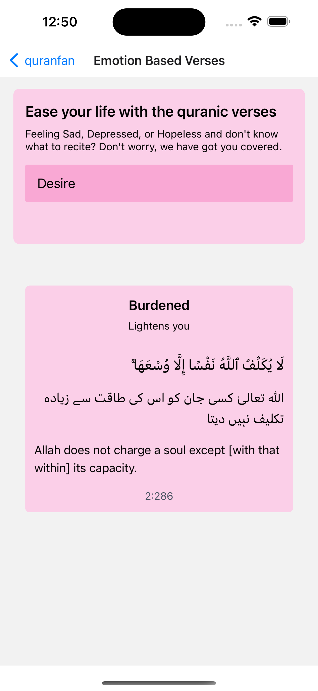
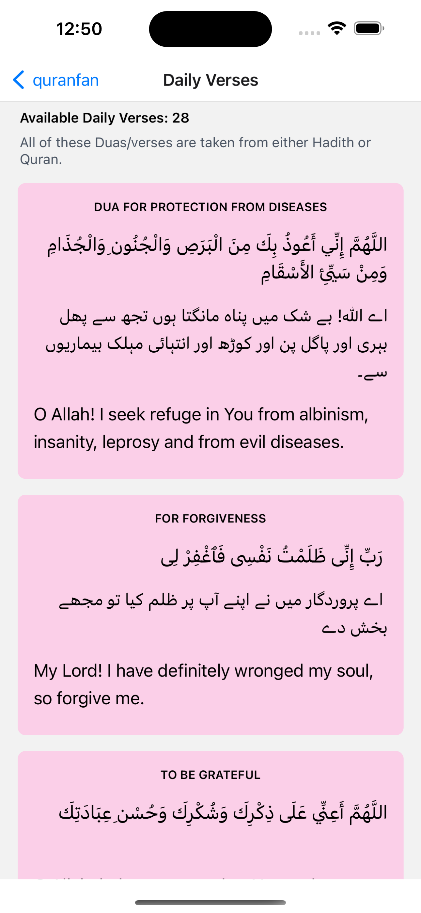

# quranfan (android)

The ios version of [quranfan](https://quranfan.vercel.app), built using react-native and expo

## Screens

For now, it has 2 screens: the Emotion based Verses and Daily Verses

  

  

